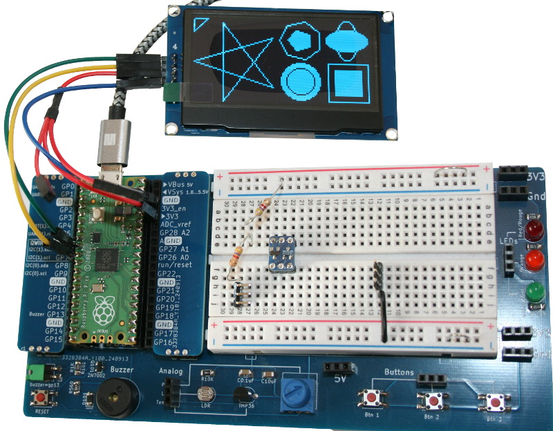
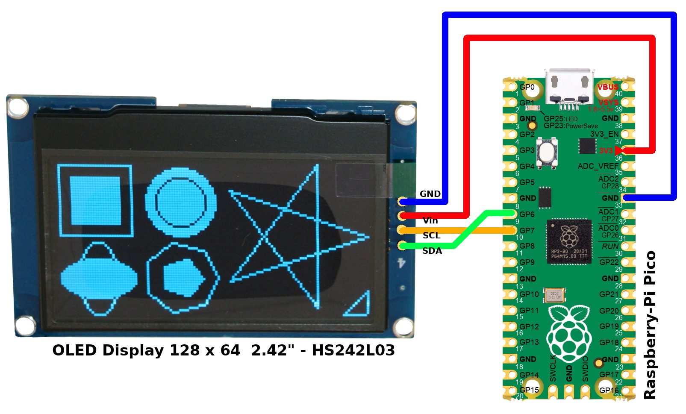
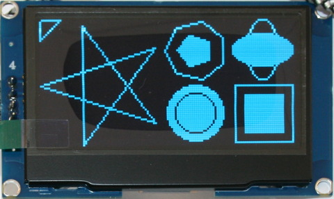
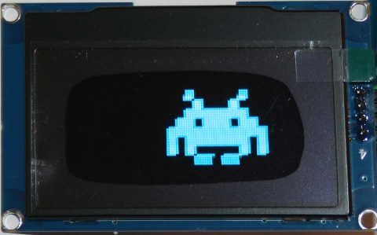
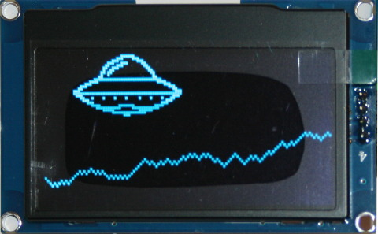
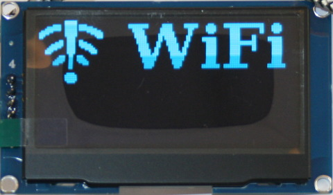
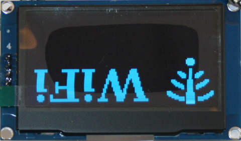

[This file also exists in ENGLISH](readme_ENG.md)

# Pilote SPI & I2C avancé pour controleur d'affichage OLED SSD1309 sous MicroPython

Ce dépôt est basé sur le magnifique travail [rdagger/micropython-ssd1309](https://github.com/rdagger/micropython-ssd1309) !



Cette bibliothèque propose de nombreuses fonctionnalités, elle peut: 

* fonctionner via un bus SPI ou I2C,
* dessiner des lignes et des formes, 
* afficher du texte avec chargement dynamique de la font, 
* afficher des sprites,
* afficher des images,  
* Défillement (scroll) du contenu (avec support matériel).

Ces fonctionnalités ont un coût, la bibliothèque présente une taille de 38 Ko (44.8 Ko avec le support pour font)

Tout le code est documenté et dispose d'exemples. Cette version de la bibliothèque est réorganisé et la classe principale renommée SSD1309. Le code et les exemples on été testés avec un bus I2C matériel d'un Raspberry-Pi Pico.

## A propos des fonts
Des exemples de fonts XGLCD sont inclus dans le répertoire [fonts/](fonts/). Des fonts supplémentaires peuvent être générés depuis des fonts TTF en utilisant le logiciel libre MikroElektronika [GLCD Font Creator](https://www.mikroe.com/glcd-font-creator).

Le répertoire [fonts/](fonts/) contains font files that can be copied on the MicroPython plateform (preference in a `fonts` subfolder). 

Remarques: 

* Les fonts sont des fichiers c traité (`parsed`) à la volée par la bibliothèque afin de créer une représentation binaire en mémoire.
* Les fichiers `fonts` sont généralement volumineux!

## A propos des images

La bibliothèque peut charger des images monochrome au format monoHMSB. La bibliothèque contient plusieurs exemples d'images disponibles dans le répertoire [images/](images/).

L'utilitaire [utils/img2monoHMSB.py](utils/img2monoHMSB.py) permet de convertir des images au format JPEG et PNG vers le format monoHMSB.

# Bibliothèque

La bibliothèque doit être copiée sur la carte MicroPython avant d'utiliser les exemples.

Sur une plateforme MicroPython avec WiFi:

```
>>> import mip
>>> mip.install("github:mchobby/micropython-ssd1309")
```

Ou en utilisant l'utilitaire `mpremote` depuis un ordinateur :

```
mpremote mip install github:mchobby/micropython-ssd1309
```

## Fonts & images

L'installation du pilote ne copie pas les images vers le système de fichiers MicroPython.

__Vous aurez besoin de copier ces ressources manuellement lorsque cela sera nécessaire.__

# Brancher
## Branchement I2C avec Pico



# Exemples

## Demo Shapes
Le script [examples/demo_shape.py](examples/demo_shapes.py) dessine différentes formes grâce aux différentes méthodes de la bibliothèque SSD1309. 



## Demo Scroll Manual
Le script [examples/demo_scroll_manual.py](examples/demo_scroll_manual.py) démontre l'usage du défilement matériel. 

Cela offre un défillement fluide et efficace avec un minimum de surcharge processeur.

La première partie du script fait défiller une image de droite à gauche sur l'écran.


La seconde section du script fait défiller les montages en arrière plan sous le vaisseau spacial.



https://github.com/user-attachments/assets/14209ff1-a0f7-4997-b1d5-76dab3f15c07

## Demo Scroll
Le script [examples/demo_scroll.py](examples/demo_scroll.py) charge une font, dessine du texte et objet graphique PUIS organise différentes opérations de défillement (incluant du Split Scroll).

## Demo Flip
Le script [examples/demo_flip.py](examples/demo_flip.py) charge une font et une image WiFi pour l'afficher sur l'écran PUIS retourne le contenu sur l'écran.

  

## Demo fonts
Le script [examples/demo_fonts.py](examples/demo_fonts.py) charge différentes fonts et affiche du texte (en utilisant toutes les fonts en une fois) sur l'afficheur.

Charge les fonts suivantes:

* Bitstream_Vera35x32.c
* Bally7x9.c
* Robotron13x21.c
* Wendy7x8.c

## Demo Images
Le script [examples/demo_images.py](examples/demo_images.py) charge des images monochrome HMSB et les affiches sur l'écran.

Charge les images suivantes:

* eyes_128x42.mono
* doggy_jet128x64.mono
* invaders_48x36.mono

## Demo Sprite
Le script [examples/demo_sprite.py](examples/demo_sprite.py) charge l'image `saucer_48x26.mono` (monochrome HMSB), l'encapsule dans la classe `BouncingSprite` puis fait la fait rebondir sur l'écran.

## Demo Bouncing Boxes
Le script [examples/demo_bouncing_boxes.py](examples/demo_bouncing_boxes.py) affiche plusieurs boites de taille différentes qui rebondissent sur l'écran. 

# Ressources

* Tutoriel de la bibliothèque originale sur le [Rototron website](https://www.rototron.info/projects/wi-fi-caller-id-blocking/). Voir aussi la [vidéo YouTube](https://youtu.be/GhXtQNxpKeo)
* Un autre [tutoriel](https://www.rototron.info/projects/wi-fi-caller-id-blocking/) utilisant la bibliothèque originale. Voir la [vidéo YouTube](https://youtu.be/b63ZPafPQVM) correspondante.

Exemple vidéo du défillement matériel:

https://github.com/user-attachments/assets/14209ff1-a0f7-4997-b1d5-76dab3f15c07
